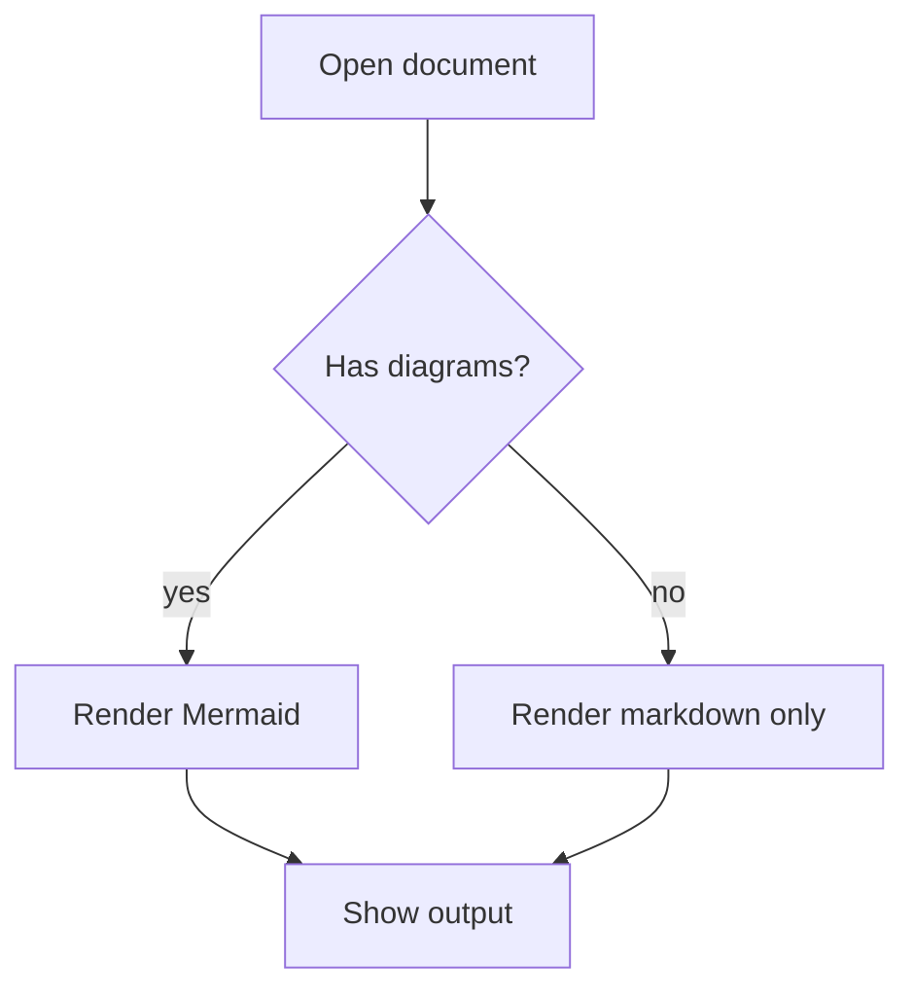

# Rich Rendering Demo

This document exercises math, LaTeX, and Mermaid rendering.

Inline math example: $E = mc^2$ and $\alpha + \beta = \gamma$.

Display math example:

$$
\sum_{k=1}^{n} k = \frac{n(n + 1)}{2}
$$

Mermaid flowchart:



LaTeX fenced block:

```latex
\int_0^1 x^2\,dx = \frac{1}{3}
```
